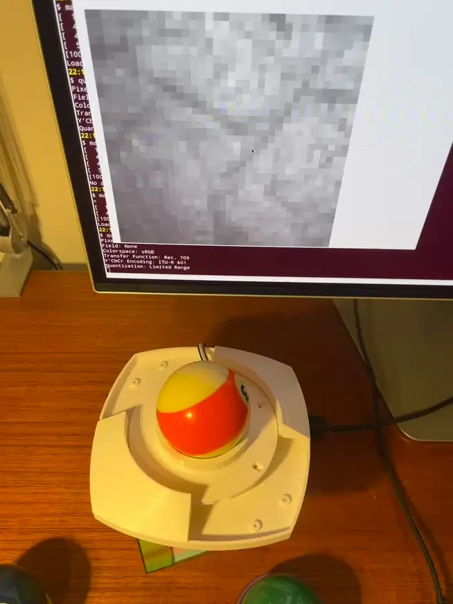
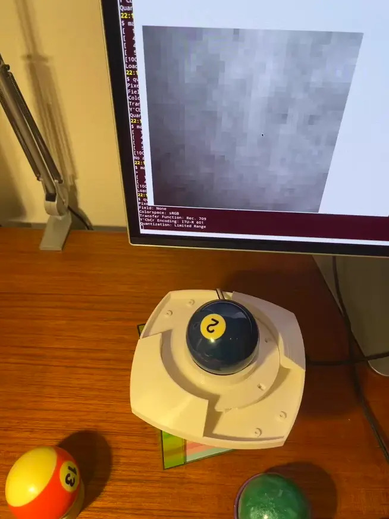
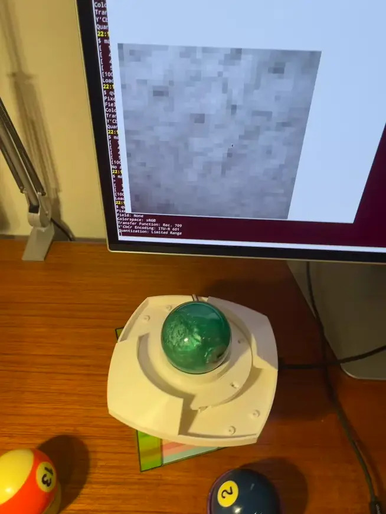

# PMW3360+RP2040 webcam

This sets up a [`rp2040-pmw3360`](https://github.com/jfedor2/rp2040-pmw3360) board to be used as a primitive webcam device. 
It uses the PMW3360 sensor to capture a 36x36 pixel greyscale image.

This can be useful to inspect properties of surfaces (for instance trackballs) to determine where there's tracking problems.

## Compilation

## Examples

Bumped up old trackball. Great surface tracking but too rough.

New trackball. Very few surface features, tracks poorly.

Pearlized trackball. Seemingly more surface features but no good tracking.

## License 

This project is MIT licensed.

It has together with code samples from Ha Thach (tinyusb) and Jacek Fedryński (jfedor2).
Everything else is copyright 2025 Thomas Weber.
